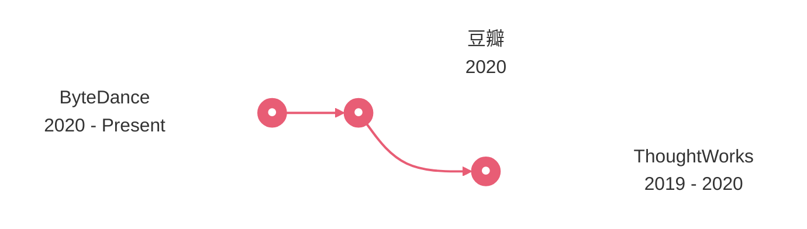

<h2 align="center">:ghost: Hello stranger，I'm ltoddy :ghost:</h2>

I'm not just a programmer — I'm a problem solver. I love coding, and everything I do is driven by genuine interest.

I believe the best engineers are interdisciplinary thinkers — people who can bridge fields like physics and computer
science. I also believe the future belongs to the deep integration of hardware and software, with devices becoming
smaller, smarter, and more powerful, ultimately pushing humanity forward.

```racket
(define information
  #hash([#:name . "liutao"]
        [#:emails . '("taoliu0509@gmail.com" "liutao.rs@bytedance.com")]
        [#:languages . '(Rust Golang Python)]
        [#:company . "Bytedance"]
        [#:title . "full stack engineer"]
        [#:learning . "AI technologies"]))
```

### Career Journey


